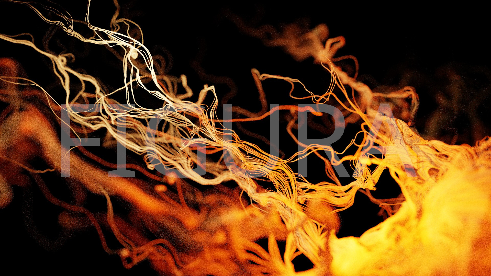
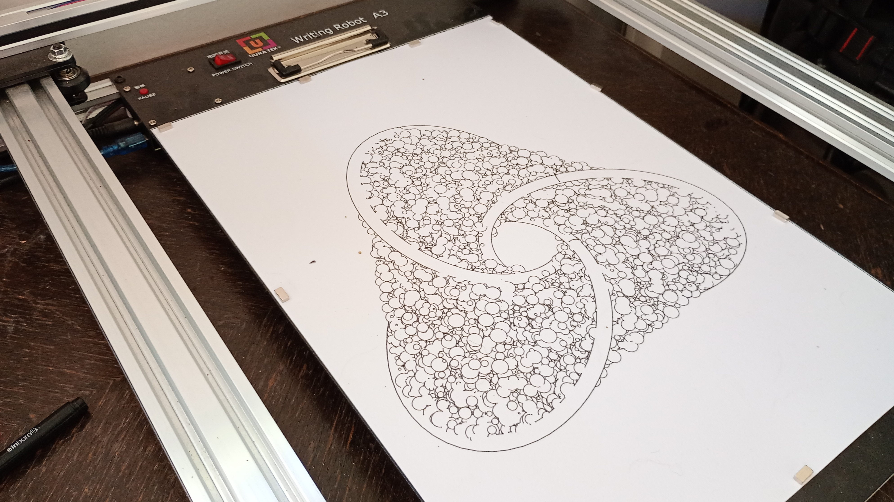
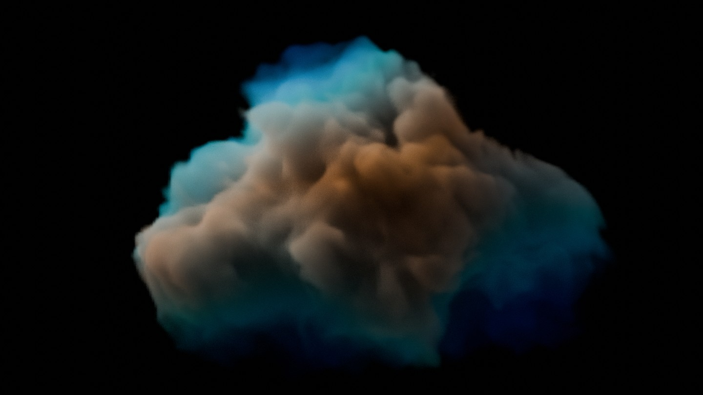

## Visual
---

### Digital Prints

Visit ArtStation for my [digital prints](https://www.artstation.com/figuraartlab/prints?print_type=art_poster)!

### Pen Plotter Prints

Coming soon!

## Audio
---

### Music

Creative commons music made by me is available [here](https://soundcloud.com/user-890444542).

Coming soon to Band Camp!

## Courses
---

I am creator of:
* Procedural Modeling Course: https://github.com/lorentzo/ProceduralModelingLectures
* Computer Graphics Foundations Course: https://github.com/lorentzo/IntroductionToComputerGraphics

## Collaborations
---
* Digital Art
* Motion Graphics
* VFX
* CGI